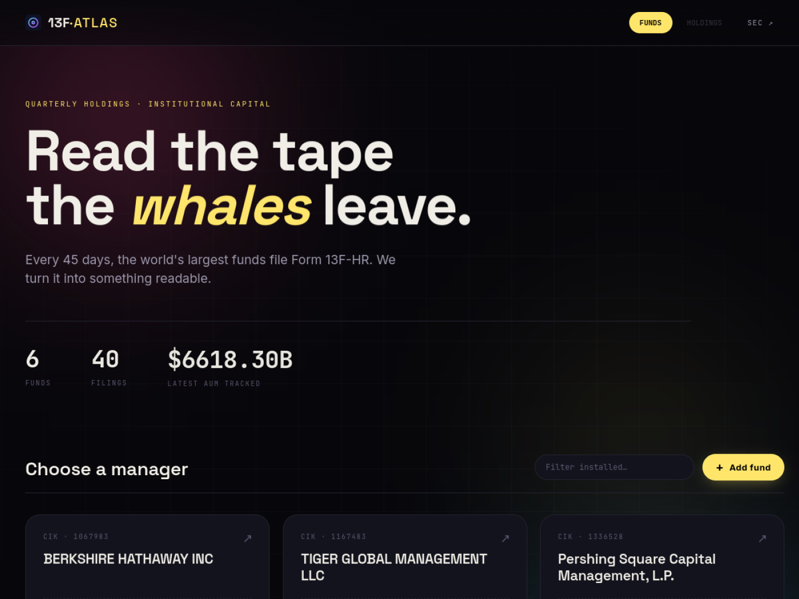

# 13F Atlas

[Live Demo](https://awesome13f.com) | [Community Listing](https://community.iamstarchild.com/1444-13f-atlas)



## English
13F Atlas is an interactive SEC Form 13F dashboard for institutional holdings analysis.
It supports fund drill-down, portfolio allocation treemap, baseline comparison, and quarter-over-quarter holdings changes.

Key highlights:
- Fund-level and period-level navigation
- Top holdings and concentration view
- QoQ position diff (adds / trims / exits)
- Baseline overlays (SPY / QQQ / IWM / GLD)

## 中文
13F Atlas 是一个面向 SEC 13F 申报数据的交互式可视化看板，用于机构持仓分析。
支持按基金和季度下钻、持仓结构树图、基准对比，以及季度间仓位变化追踪。

核心能力：
- 基金与季度双维度浏览
- 头部持仓与集中度观察
- 持仓环比变化（新进/加仓/减仓/清仓）
- 基准序列对照（SPY / QQQ / IWM / GLD）

## Quick Start
```bash
python server.py
```

Default port: `8765`

## Environment (optional)
- `SEC_USER_AGENT`
- `F13_DATA_DIR`

## License
MIT
